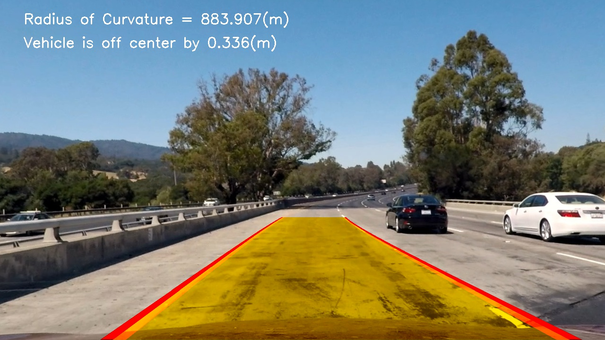

##Writeup Template
###You can use this file as a template for your writeup if you want to submit it as a markdown file, but feel free to use some other method and submit a pdf if you prefer.

---

**Advanced Lane Finding Project**

The goals / steps of this project are the following:

* Compute the camera calibration matrix and distortion coefficients given a set of chessboard images.
* Apply a distortion correction to raw images.
* Use color transforms, gradients, etc., to create a thresholded binary image.
* Apply a perspective transform to rectify binary image ("birds-eye view").
* Detect lane pixels and fit to find the lane boundary.
* Determine the curvature of the lane and vehicle position with respect to center.
* Warp the detected lane boundaries back onto the original image.
* Output visual display of the lane boundaries and numerical estimation of lane curvature and vehicle position.

[//]: # (Image References)

[image1]: ./projectImages/camera.jpg "Camera Caliberation"
[image2]: ./projectImages/undistorted.jpg "Undistorted Chess"
[image3]: ./projectImages/binary.jpg "Binary Example 1"
[image4]: ./projectImages/binary2.jpg "Binary Example 2"
[image5]: ./projectImages/perspective.jpg "Perspective Example 1"
[image6]: ./projectImages/perspective2.jpg "Perspective Example 2"
[image7]: ./projectImages/hist.jpg "Histogram Example 1"
[image8]: ./projectImages/hist2.jpg "Histogram Example 2"
[image9]: ./projectImages/boundingWindows.jpg "Bounding Windows 1"
[image10=250x]: ./projectImages/boundingWindows2.jpg "Bounding Windows 2"
[image11]: ./projectImages/final1.jpg "Final Output Example 1"
[image12]: ./projectImages/final2.jpg "Final Output Example 2"
[video1]: ./project_video.mp4 "Video"

---
###Writeup / README

###Camera Calibration

####1. Briefly state how you computed the camera matrix and distortion coefficients. Provide an example of a distortion corrected calibration image.


I start by preparing "object points", which will be the (x, y, z) coordinates of the chessboard corners in the world. Here I am assuming the chessboard is fixed on the (x, y) plane at z=0, such that the object points are the same for each calibration image.  Thus, `objp` is just a replicated array of coordinates, and `objpoints` will be appended with a copy of it every time I successfully detect all chessboard corners in a test image.  `imgpoints` will be appended with the (x, y) pixel position of each of the corners in the image plane with each successful chessboard detection.  


I then used the output `objpoints` and `imgpoints` to compute the camera calibration and distortion coefficients using the `cv2.calibrateCamera()` function.  I applied this distortion correction to the test image using the `cv2.undistort()` function and obtained this result:


The result for this section can be found in Section 1 of my code under "Camera Caliberation" and "Correcting Distortion"


####2. Describe how (and identify where in your code) you performed a perspective transform and provide an example of a transformed image.

I spent ours playing around with the src and dst point to get a reasonable mapping for the lanes. At the end the 4 points provided in the rubric beat my own tunning. One of the key factors was that the src points extended across the y-axis of the image. the offset parameter which is shown in the code snippet below controls how much of the original image is included in the perspective transform. The lower the number the more streched out the final image. This means less of the original image is going to be included in the final image. This was a key parameter to exclude excessive features from going into the model. For instnace if offset was larger, we would be including cars and lanes in which the car is not driving in. 

The result for this section can be found in Section 2 of my code under "Perspective Transformation".
```
offset = 290
# in the cv2 transformation first dimension is x second is y 
# in image.shape first dimension is y then x
img_size = (img.shape[1],img.shape[0])
src = np.float32([[585,460],
                  [203,720],
                  [1127,720],
                  [695,460]])
dst = np.float32([[offset,0],
                  [offset,img_size[1]],
                  [img_size[0]-offset,img_size[1]],
                  [img_size[0]-offset,0]])

```
This resulted in the following source and destination points:

| Source        | Destination   | 
|:-------------:|:-------------:| 
| 585, 460      | 290, 0        | 
| 203, 720      | 290, 720      |
| 1127, 720     | 910, 720      |
| 695, 460      | 910, 0        |

I verified that my perspective transform was working as expected by drawing the `src` and `dst` points onto a test image and its warped counterpart to verify that the lines appear parallel in the warped image. See images below for some examples:


####3. Describe how (and identify where in your code) you used color transforms, gradients or other methods to create a thresholded binary image.  Provide an example of a binary image result.

The course provides us a vareity of tools for detecting lane lines in the images as follows: (1) gradient in x and y directions, (2) magnitute of gradient, (3) angle of gradient, (4) HSV and HLS color spaces.

I spent a lot of time playing around with various combinations of them. I also took advantage of the office hours. The combination of (1) large x,y gradient OR (2) large saturation (HLS) and value (HSV) channels in the HLS and HSV transformation turned out to be the most useful to cleanly detect line and colors. I am still not sure why S and V channels were the most useful channels and not for example the hue. Below are two examples that demonstrates the filters. The 


The result for this section can be found in Section 3 of my code under "Binary Image Generation"

####4. Describe how (and identify where in your code) you identified lane-line pixels and fit their positions with a polynomial?


image 1


image 2 


####5. Describe how (and identify where in your code) you calculated the radius of curvature of the lane and the position of the vehicle with respect to center.

I did this in lines # through # in my code in `my_other_file.py`

####6. Provide an example image of your result plotted back down onto the road such that the lane area is identified clearly.

I implemented this step in lines # through # in my code in `yet_another_file.py` in the function `map_lane()`.  Here is an example of my result on a test image:




---

###Pipeline (video)

####1. Provide a link to your final video output.  Your pipeline should perform reasonably well on the entire project video (wobbly lines are ok but no catastrophic failures that would cause the car to drive off the road!).

Here's a [link to my video result](./submission_video.mp4)

---

###Discussion

####1. Briefly discuss any problems / issues you faced in your implementation of this project.  Where will your pipeline likely fail?  What could you do to make it more robust?

Here I'll talk about the approach I took, what techniques I used, what worked and why, where the pipeline might fail and how I might improve it if I were going to pursue this project further.  
