##Writeup Template
###You can use this file as a template for your writeup if you want to submit it as a markdown file, but feel free to use some other method and submit a pdf if you prefer.

---

**Vehicle Detection Project**

The goals / steps of this project are the following:

* Perform a Histogram of Oriented Gradients (HOG) feature extraction on a labeled training set of images and train a classifier Linear SVM classifier
* Optionally, you can also apply a color transform and append binned color features, as well as histograms of color, to your HOG feature vector. 
* Note: for those first two steps don't forget to normalize your features and randomize a selection for training and testing.
* Implement a sliding-window technique and use your trained classifier to search for vehicles in images.
* Run your pipeline on a video stream (start with the test_video.mp4 and later implement on full project_video.mp4) and create a heat map of recurring detections frame by frame to reject outliers and follow detected vehicles.
* Estimate a bounding box for vehicles detected.

---
###Writeup / README

###Histogram of Oriented Gradients (HOG)

####1. Explain how (and identify where in your code) you extracted HOG features from the training images.

The code for this step is contained in the `Section 2: Hogs and Histogram Features` of the IPython notebook`.  

For the purpose of demonstration, I started by reading 100 samples of `vehicle` and `non-vehicle` images. Then extracted the hogs features from the first layer of the RGB image of a car and a non-car image. Each image was selected randomly from a pool of 100 images. Along with the hogs features, i am also depicting the flattened out histogram of the images. The histogram extracts its values from all color channels of the images and concatnates them. 

Images below depicts a few examples of Hogs with the following parameters (1) hist_bins: 16, (2) color_space: 'RGB', (3) orient: 6, (4) pix_per_cell: 8, (5) cell_per_block: 2. 

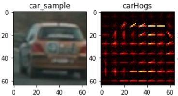
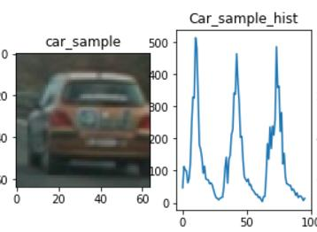
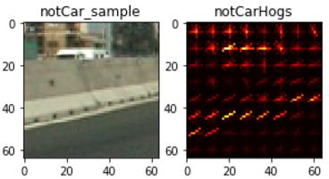
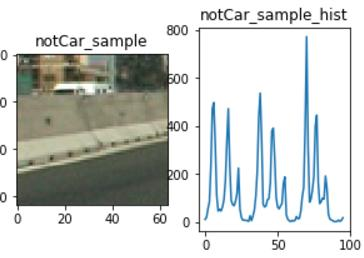

####2. Explain how you settled on your final choice of HOG parameters.

color spaces: i tried all the color spaces and tried them on the sample images, and YCrCb and LUV seem to be the most stable. I chose YCrCb. This was also recommended in the office hours.
Hogs features: applying hogs features to all 3 image channels improved support vector classifier compared to only using 1 image channel
Orientation: increasing orientation from 6 to 9 bins in hogs transformation improved the accuracy of SVC.
Spatial sizes of (16,16) and (32,32) were experimented and (32,32) showed better accuracy in SVC
histogram features: i went with the default value of 32
for training hogs features, histogram and spatial sizing features were concatnated together to form a long vector of size 7284. For more details please see `Section 2: Hogs and Histogram Features` of my code.

####3. Describe how (and identify where in your code) you trained a classifier using your selected HOG features (and color features if you used them).

Data was split to 80% for training and 20% for test.
SVC tunning was done by playing with the following models

* svc = LinearSVC() - Based on class recommendation
* svc = LinearSVC(loss='l2', penalty='l1', dual=False,C = 100) - To generate sparse features 
* svc = LinearSVC(C = 5E-5) - To over-come overfitting we can reduce the penalty for slack variables 
* svc = svm.SVC(kernel= 'poly') - To try non-linear fits i tried polynomial SVC

i had similar results with l1 regularization or by tweeking C. I decided to go with the simpler model of  LinearSVC(C = 5E-5). The model gives me around 99% accuracy across both training and test set.
Once i am done with tunning, i will use the entire data set to trian my final SVC model. For more details please see `Section 4: Training a Linear SVC model` of my code.  

###Sliding Window Search

####1. Describe how (and identify where in your code) you implemented a sliding window search.  How did you decide what scales to search and how much to overlap windows?

scale (or sliding window size) was another parameter that i spent considerable amount of time tunning. The smaller the scale the smaller the windows sizes because we stretch the original image. When i only used scales > 1, i was not be able to detect vehicles that were further from the camera occasionally. So i decided to include one scale less than 1 and 3 scales larger than 1. Initially spent one day trying to find the right combination of scales, but eventually consulted with another student "Katharina". Her scales were above 1, but her methodology for tunning helped my tune my scale parameter. I applied different scales to the test images along with varying degree of heat threshold and made sure that the heat map is detecting all the vehicles in all images, while not allowing any noise (false detection). 

Here the challenges were (1) tracking all the car (2) reducing false positives. Often these two competed against each other. for example by making windows smaller or changing them, i could detect cars more easily but also i would detect noise more easily. 

anothe parameter for tunning was cells_per_step. The larger values means the we will have less windows and less overlaps. With scales smaller than 1, we can increase the step size to avoid having too many small windows. Below are result from applying each of the 4 scales individually to each image (title of the image represent the scale). Notice that some cars are not visible in some scales but are in other scales. That is why we should have a combination of them. 

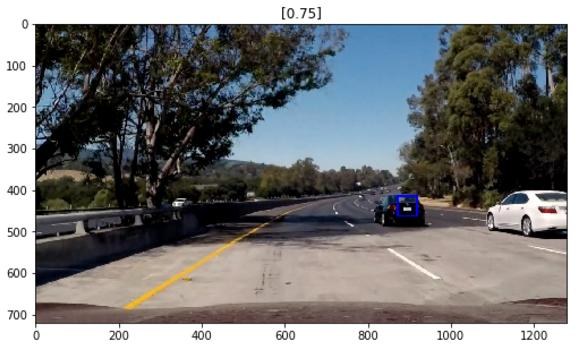
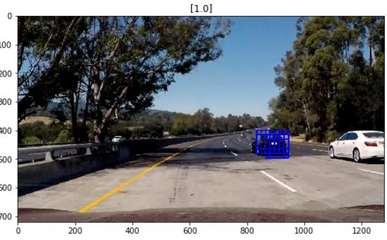
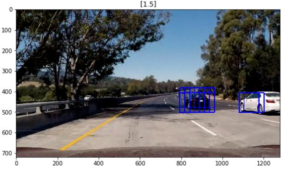
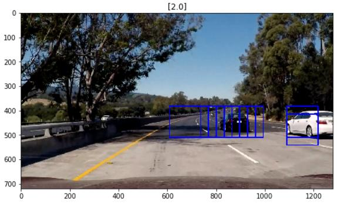

Here we can combine all bounding boxes and apply them to the image. For more details and pictures please see `Section 6: Sliding windows tunning`

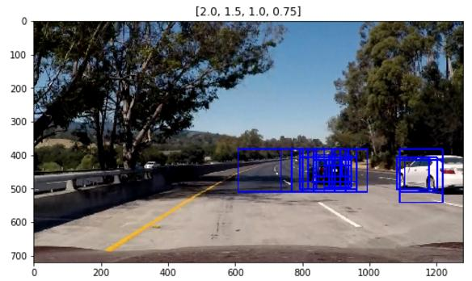

####2. Show some examples of test images to demonstrate how your pipeline is working.  What did you do to optimize the performance of your classifier?

Ultimately I searched on 4 scales using YCrCb 3-channel HOG features plus spatially binned color and histograms of color in the feature vector, which provided a nice result. Below i am providing some samples of the above application in addition to the heat map results and histogram of heatmap for values larger than 0. I used this histogram to find the right threshold for my heatmap filter. 

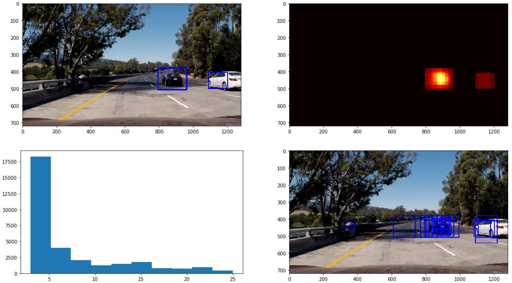
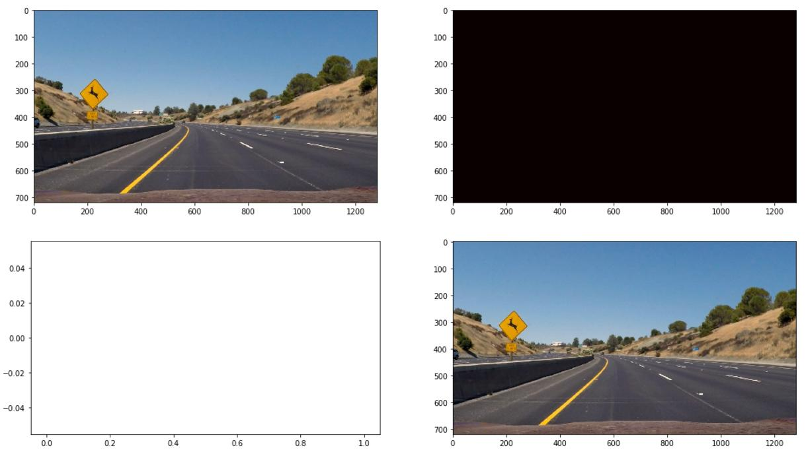
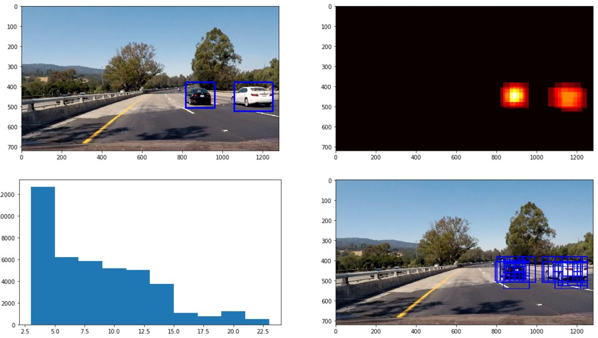
---

### Video Implementation

####1. Provide a link to your final video output.  Your pipeline should perform reasonably well on the entire project video (somewhat wobbly or unstable bounding boxes are ok as long as you are identifying the vehicles most of the time with minimal false positives.)
for more details please see `Section 5: Video Pipline & HeatMap Diagnosis`
Here's a [link to my video result](./submission_video.mp4)

####2. Describe how (and identify where in your code) you implemented some kind of filter for false positives and some method for combining overlapping bounding boxes.

I recorded the positions of positive detections in each frame of the video.  From the positive detections I created a heatmap and then thresholded that map to identify vehicle positions.  I then used `scipy.ndimage.measurements.label()` to identify individual blobs in the heatmap.  I then assumed each blob corresponded to a vehicle.  I constructed bounding boxes to cover the area of each blob detected.  

smoothing and averaging of frames: to make the result more stable and reduce false positive i tried two approaches: 
* exponential decay: in this approach i decayed the heatmap from previous slides by a factor named "forget_rate" between [0,1]. The calculation is as follows:  (1- forget_rate)x(heat) + (forget_rate)x(headmapHistory). 
* averaging: i averaged the heat map from 10-15 frames. I results became more jittery with smaller number of frames, but with too many frames a false positive could last on the images for a longer period of time. 

The images in the previous section included the heapmap across the test images. 

---

###Discussion

####1. Briefly discuss any problems / issues you faced in your implementation of this project.  Where will your pipeline likely fail?  What could you do to make it more robust?

I spent 2 days just tunning parameters. This particularly was challenging because the video processing was very slow. It took more than 30 min for the project video to get processed. Also the tunning process was very manual. I first chopped the project video into smaller segments of 10 seconds in areas where i was facing problems, and ran my tunning on top of those smaller videos. Overall, i found a sweet spot that made tracking work well, but i think there has to be a better of doing this. I also think the class videos should cover (1) the tunning details and strategies more thoroughly (2) the python class functionality to track the vehicles. This information has been hard to find. 

